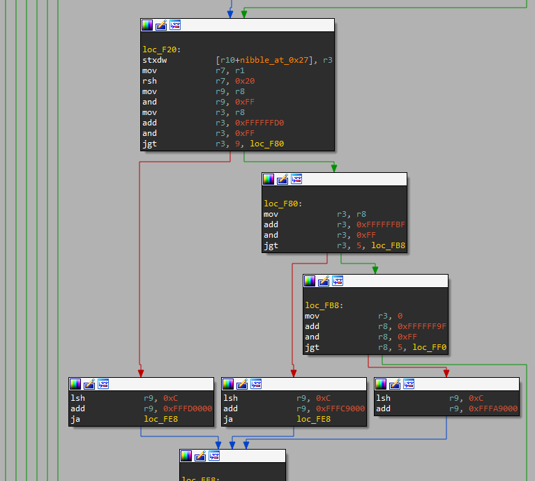

# eBPF IDA Proc

This is an IDA Processor that can be used to disassemble eBPF bytecode. It was developed for a challenge. As such, it hasn't been tested with any other target than the crackme-esque filter I developed it for.

## Author

Clément Berthaux - clement (dot) berthaux (at) synacktiv (dot) com

## Installation

You just need to place `ebpf.py` in your `IDA_ROOT\procs` folder.

